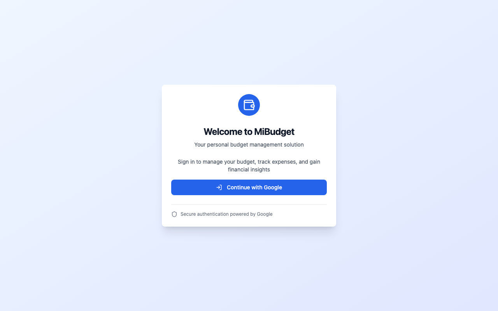

# MiBudget Functionality Report

This document highlights the core functionalities of the MiBudget application, accompanied by screenshots taken from the latest end-to-end tests.

## 1. Dashboard
The Dashboard provides a unified overview of all active accounts and recent financial activity.
It aggregates data to present an accurate picture of total balances and cash flow velocity.

## 2. Transactions
The Transactions view handles all incoming bank data. It includes a robust categorization and reconciliation engine to correctly classify expenses and ensure all data aligns with the actual bank statements.

## 3. Budget
The Budget section is the core planning tool for managing categories, rules, and recurring expenses.
Users can view and adjust category allocations, ensuring that all money receives a job before the month starts.

## 4. Projections
Projections take the current baseline and extrapolate it into the future to help predict long-term financial health.
It allows testing different scenarios such as expected windfalls or new ongoing expenses.

## 5. Settings
Settings provide the capability to toggle application-wide configurations, beta features, and adjust notification preferences or source mappings.

